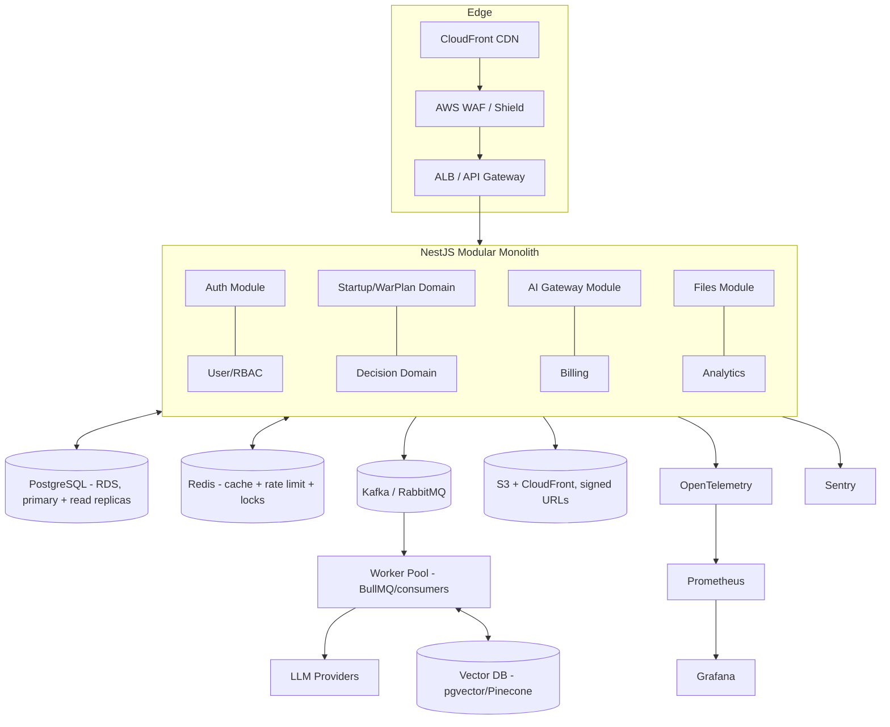
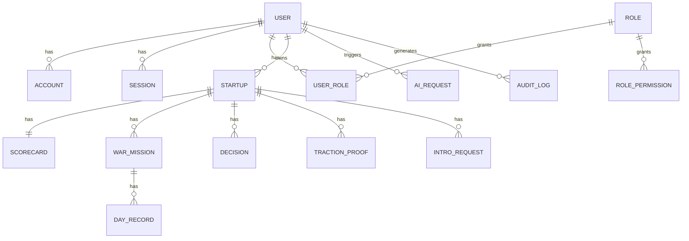

# VEIXON — Backend Architecture & Scaling Blueprint
*Target: 100 → 10,000,000 users without a rewrite. Modular monolith now, microservice-ready later.*

---

## 1. Audit of the current backend

| Area | Today (observed in repo) | Verdict |
|---|---|---|
| Runtime | Next.js App-Router API routes (`app/api/**`) on Vercel | OK to start, but not a real service boundary |
| Data layer | **Split brain**: Prisma/Postgres (`lib/server-store.ts`, `/routing`) **+** MongoDB (`lib/db.js`) **+** in-memory store | 🔴 Critical: two sources of truth, no transactions across them |
| AI | `lib/anthropic.ts` → **NVIDIA Nemotron** (function misnamed `callClaudeJson`), single provider, regex JSON extraction | 🔴 No abstraction, no retries/timeouts/cost tracking |
| Auth | NextAuth Google OAuth, JWT session, `NEXTAUTH_SECRET` | 🟠 No refresh-token rotation, no RBAC, no revocation |
| Caching | None | 🔴 Every request hits DB / model |
| Queues/async | None — heavy AI calls run inline in request (`maxDuration 60`) | 🔴 Blocks, times out, no retries |
| Rate limiting / abuse | None | 🔴 Open to abuse + cost blowout (public `/api/ai/teaser`) |
| Observability | `console.error` only | 🔴 No metrics, traces, error tracking |
| Tests | None found | 🔴 0% coverage |
| Files | `html2canvas` client-side; no object storage | 🟠 Not scalable |
| Migrations | Prisma schema exists; Mongo ad-hoc | 🟠 Inconsistent |
| Reliability | Several **silently truncated source files** found & repaired this session | 🔴 No CI gate caught it |

**Top 5 scaling bottlenecks**
1. Dual datastore (Prisma + Mongo) → impossible to reason about consistency, no single migration path.
2. Synchronous LLM calls inside HTTP handlers → tail latency, timeouts, no backpressure.
3. No cache → DB and model are the hot path for read-heavy pages (dashboard, war plan).
4. Serverless function model (Vercel) caps long jobs, no persistent workers, cold starts.
5. No connection pooling discipline → Postgres connection exhaustion at scale.

**Top security risks (OWASP-mapped)**
- A01 Broken Access Control: no RBAC, ownership checks ad-hoc.
- A02 Crypto Failures: no field encryption for PII (oath, traction, revenue).
- A04 Insecure Design: public AI endpoint with no rate limit = cost/DoS vector.
- A07 Auth failures: no refresh rotation, no session revocation, secret handling.
- A09 Logging failures: no audit trail, no security telemetry.

---

## 2. Target architecture (modular monolith → microservice-ready)



**Principles:** Clean Architecture (domain ← application ← infrastructure ← interface), DDD bounded contexts, SOLID, event-driven via an **outbox + Kafka**. One deployable now (monolith), each module already a bounded context so it can be carved into a service later (strangler pattern) with **zero domain rewrite**.

**Module layout (NestJS)**
```
src/
  modules/
    auth/        identity/      users/      rbac/
    startups/    warplan/       decisions/  checkins/
    ai-gateway/  prompts/       agents/     rag/
    files/       billing/       analytics/  notifications/
  shared/        (domain primitives, result types, errors, guards)
  infra/         (db, redis, kafka, s3, telemetry, config)
  main.ts
```
Each module: `domain/` (entities, value objects, domain events) · `application/` (use-cases, ports) · `infrastructure/` (repos, adapters) · `interface/` (REST + GraphQL resolvers, DTOs).

---

## 3. Database (PostgreSQL) — one source of truth

Kill MongoDB. Consolidate to **PostgreSQL** (RDS Multi-AZ + read replicas; pgvector extension for embeddings). Prisma stays as the ORM (already present), with a clean schema.

**Core ER (simplified)**


**Conventions on every table**
- `id uuid pk default gen_random_uuid()`
- `created_at`, `updated_at` (trigger-maintained), `created_by`, `updated_by`
- `deleted_at timestamptz null` → **soft delete** (partial indexes `WHERE deleted_at IS NULL`)
- `version int` → optimistic concurrency (version tracking)
- JSON blobs (`scorecard_json`, `war_plan_json`) move to typed columns + `jsonb` only where schema is genuinely dynamic; `jsonb` columns get GIN indexes.

**Indexing & query plan**
- `startup(user_id) WHERE deleted_at IS NULL` (hot: routing, dashboard).
- `day_record(startup_id, week, day)` unique.
- `ai_request(user_id, created_at desc)` for usage/billing.
- Composite covering indexes for the dashboard read; `EXPLAIN ANALYZE` gate in CI (no seq-scan on hot paths).
- Cursor pagination everywhere (`(created_at, id)` keyset), never `OFFSET` at scale.

**Audit & RBAC**
- `audit_log(actor_id, action, entity, entity_id, before jsonb, after jsonb, ip, ua, created_at)` written via domain events (async) — immutable, partitioned by month.
- RBAC tables: `role`, `permission`, `role_permission`, `user_role`. Enforced by a `@RequirePermission()` guard + row-level ownership checks; Postgres **RLS** as defense-in-depth.

**Migration strategy (Mongo+Prisma → single Postgres)**
1. Freeze new Mongo writes; introduce repository interfaces (ports) so domains don't know the store.
2. Backfill job: stream Mongo docs → typed Postgres rows (idempotent, checksummed).
3. **Dual-read / shadow-write** window: write both, read Postgres, compare → alert on drift.
4. Cut reads to Postgres, stop Mongo writes, decommission. Reversible at each step.
5. All schema changes via versioned Prisma migrations in CI; **expand→migrate→contract** (no destructive online change).

---

## 4. API design
- **REST** (primary) under `/api/v1` + **GraphQL** (`/graphql`) for the dashboard's nested reads; both generated from the same application use-cases (no logic in controllers).
- **OpenAPI/Swagger** auto-generated (`@nestjs/swagger`) at `/docs`.
- **Versioning** via URI (`/v1`) + deprecation headers.
- **Consistent envelope**: `{ data, error: {code,message,details,traceId}, meta:{pagination} }`. Errors are typed (`AppError` → HTTP map), never leak stack traces.
- **Validation**: `class-validator` DTOs + Zod at the edge; reject unknown fields.
- **Rate limiting**: Redis token-bucket per IP + per user + per route; stricter on `/ai/*` and public `/teaser`. Idempotency keys on mutations.

---

## 5. Auth & security (Zero Trust, OWASP Top 10)
- **JWT access (short, 10 min) + refresh token rotation** (httpOnly, rotating, reuse-detection → revoke family). Sessions table for revocation.
- **OAuth**: Google + GitHub via Passport strategies; account linking.
- **RBAC** (roles: user, admin, support) + permission guards + Postgres RLS.
- Encryption: TLS everywhere (in transit); **KMS-managed** encryption at rest (RDS, S3); app-level field encryption (pgcrypto/envelope) for PII (oath, revenue, traction).
- Input sanitization, parameterized queries (ORM) → SQLi safe; output encoding → XSS; CSRF tokens for cookie flows; Helmet headers, strict CORS.
- Abuse/DDoS: AWS WAF + Shield, Redis rate limits, per-key AI budgets, bot detection on public endpoints.
- Secrets in AWS Secrets Manager; no secrets in env files in repo.

---

## 6. AI & Intelligence layer (provider-agnostic)
This directly replaces the single `lib/anthropic.ts`.

```
ai-gateway/
  domain/        LlmProvider (port), ChatRequest, Completion, Embedding
  providers/     openai/ anthropic/ gemini/ groq/ ollama/ nvidia/   (adapters)
  router.ts      model routing + fallback chain + circuit breaker
  prompts/       versioned prompt registry (db-backed, A/B + rollback)
  agents/        LangGraph orchestration, tool registry, multi-agent
  rag/           ingestion → chunk → embed(pgvector/Pinecone) → retrieve
  usage/         token+cost metering per request/user/tenant
```
- **Provider abstraction**: one `LlmProvider` interface; providers are pluggable adapters (OpenAI, Anthropic, Gemini, Groq, Ollama, NVIDIA). Config-driven model routing (cheap model for teaser, strong model for full analysis).
- **Reliability**: timeouts, retries with jitter, **circuit breaker**, automatic fallback to the next provider, response caching by prompt hash.
- **Prompt management**: prompts are versioned records (your `lib/curriculum/frameworks.ts` becomes seed data), enabling A/B tests, eval gating, and instant rollback.
- **Agents/RAG**: LangGraph state machines + tool registry; RAG over the 90-day curriculum + founder history via pgvector; memory layer (short-term Redis, long-term Postgres/vector).
- **All AI runs async**: the HTTP route enqueues a job and returns a `jobId`; the worker calls the provider and emits `ai.analysis.completed` → client gets it via SSE/websocket or poll.

---

## 7. Event-driven system
- **Outbox pattern**: domain writes + event row in the same Postgres tx → relay publishes to **Kafka** (or RabbitMQ for simpler start) → exactly-once-ish, no lost events.
- **Topics**: `ai.requested`, `ai.completed`, `startup.created`, `day.completed`, `vault.unlocked`, `audit.*`, `analytics.*`, `email.*`.
- **Workers** (BullMQ on Redis for jobs, Kafka consumers for streams): AI processing, email (Resend), notifications (FCM), file processing, analytics, audit writes.
- Everything heavy is async with retries + DLQ; idempotent consumers.

---

## 8. Performance budget
- API p95 < 100 ms (excluding model calls, which are async), DB p95 < 50 ms, 99.99% uptime.
- **Redis**: cache-aside for read-heavy entities (startup, war plan, scorecard) with event-driven invalidation; rate-limit + distributed locks.
- PgBouncer connection pooling; read replicas for dashboards; keyset pagination; N+1 killed via DataLoader (GraphQL).
- Background jobs for all >50 ms work.

---

## 9. Observability
- **OpenTelemetry** traces across HTTP → use-case → DB → Kafka → worker → provider (one `traceId` end-to-end, surfaced in error envelope).
- **Prometheus** metrics (RED + USE) → **Grafana** dashboards + alerts (SLO burn-rate).
- **Sentry** for exceptions; structured JSON logs → Loki/CloudWatch; AI cost & token dashboards; health/readiness/liveness probes.

---

## 10. DevOps
- **Docker** multi-stage images; **Kubernetes** (EKS) with HPA autoscaling; separate **dev / staging / prod** clusters/namespaces.
- **CI/CD (GitHub Actions)**: lint → typecheck → unit → integration → e2e → build → scan (Trivy/Snyk) → migrate (expand) → deploy. **Blue-green** for the app, **canary** (5%→25%→100%) for risky changes, instant rollback.
- IaC via Terraform; secrets via Secrets Manager; nightly DB backups + PITR; chaos/load tests (k6) in staging.

---

## 11. File storage
- **S3** (private buckets) + **CloudFront** CDN; **pre-signed URLs** for upload/download (short TTL); virus scan on upload (event-driven); image/video transforms via Lambda/MediaConvert; lifecycle policies for cost (IA/Glacier).

---

## 12. Analytics
- Client + server emit events → Kafka `analytics.*` → stream processor → ClickHouse/Redshift (warehouse) + real-time Materialized views; dashboards for activation, retention (the core VEIXON thesis), conversion (teaser→signup→paid), feature usage, AI cost/user, business KPIs.

---

## 13. Code quality & testing
- Strict TypeScript, ESLint, Prettier, `tsc --noEmit` gate (would have caught the truncated files).
- **Unit** (domain/use-cases, Jest), **integration** (Testcontainers Postgres/Redis/Kafka), **e2e** (Supertest/Playwright). Target **90%+** on domain + application layers; coverage gate in CI.
- ADRs for every major decision; contract tests on provider adapters.

---

## 14. Phased migration roadmap (strangler — never a big-bang)
| Phase | Deliverable | Why first |
|---|---|---|
| **0** | CI gate (typecheck/lint/test) + Sentry + structured logs | Stop silent breakage immediately |
| **1** | **AI Gateway**: provider abstraction (OpenAI/Anthropic/Gemini/Groq/Ollama/NVIDIA) + retries/fallback/usage, async via queue | Highest leverage, isolates the riskiest dependency, builds on existing `lib/anthropic.ts` |
| **2** | **Postgres consolidation**: ports + dual-read/shadow-write + backfill, kill Mongo | Removes the split-brain root cause |
| **3** | **Auth hardening**: refresh rotation + RBAC + rate limiting + audit log | Security + abuse control |
| **4** | **NestJS extraction**: move `/api/*` logic into NestJS modular monolith behind the same routes (Next stays the BFF/web) | Real service boundaries |
| **5** | Events (outbox+Kafka) + workers + observability stack | Async + visibility |
| **6** | K8s/EKS + CI/CD blue-green/canary + IaC | Scale + safe delivery |
| **7** | RAG/agents (LangGraph + pgvector), analytics warehouse | Product depth |

Each phase ships independently, behind flags, reversible, with the app live throughout.
